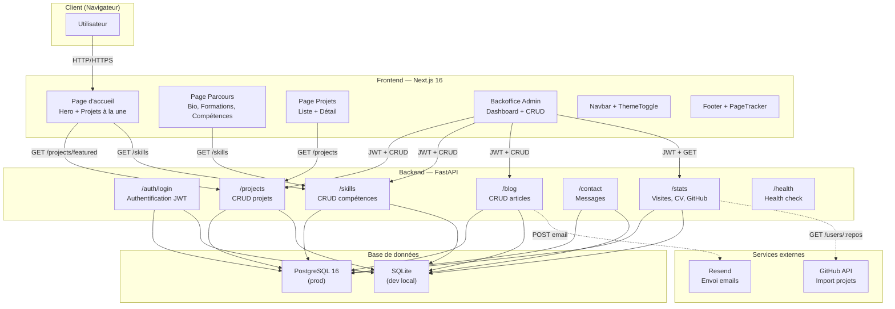

# Portfolio — KAINWANG Roger

Portfolio personnel de **KAINWANG Roger**, Data Engineer & Data Scientist. Application web full stack construite avec **Next.js**, **FastAPI** et **PostgreSQL**.

---

## Architecture



---

## Stack technique

| Composant | Technologie | Version |
|-----------|-------------|---------|
| **Frontend** | Next.js (App Router) | 16.2.6 |
| | React | 19.2.4 |
| | TypeScript | 5.x |
| | Tailwind CSS | 4.x |
| | Framer Motion | 12.x |
| **Backend** | FastAPI | 0.115.0 |
| | SQLAlchemy | 2.0.36 |
| | Alembic | 1.13.3 |
| | Python | 3.12+ |
| **Base de données** | PostgreSQL | 16 (prod) |
| | SQLite | (dev local) |
| **Authentification** | JWT (python-jose) | 3.3.0 |
| | bcrypt (passlib) | 1.7.4 |
| **Déploiement** | Vercel | Frontend |
| | Render | Backend |
| | Neon | PostgreSQL (gratuit) |
| **Conteneurs** | Docker + Docker Compose | — |

---

## Fonctionnalités

### Pages publiques
- **Page d'accueil** : Hero avec nom/titre, projets à la une, tech stack animée
- **Parcours** : Bio, formations, certifications, compétences, langues, centres d'intérêt
- **Projets** : Liste filtrable + page détaillée pour chaque projet
- **Téléchargement CV** : Bouton avec compteur de téléchargements

### Backoffice admin (`/admin`)
- **Dashboard** : Statistiques (visites, téléchargements CV, messages non lus)
- **Gestion des projets** : CRUD complet (créer, modifier, supprimer)
- **Gestion des compétences** : CRUD complet
- **Messages** : Liste des messages reçus via le formulaire contact
- **Authentification JWT** : Connexion sécurisée

### Fonctionnalités transversales
- **Mode sombre/clair** via next-themes
- **Responsive** (mobile-first)
- **Animations** avec Framer Motion
- **Tracking** des visites et téléchargements CV
- **Import GitHub** : Récupération automatique des projets depuis GitHub
- **Thème cohérent** : Polices Geist, design system consistent

---

## Démarrage rapide

### Prérequis

- **Node.js** ≥ 18
- **Python** ≥ 3.12
- **Docker** (optionnel, pour PostgreSQL)

### Installation

```bash
# Cloner le dépôt
git clone https://github.com/kainwangroger/porfolio-kr.git
cd porfolio-kr

# Backend
cd backend
python3 -m venv venv
source venv/bin/activate
pip install -r requirements.txt
cd ..

# Frontend
cd frontend
npm install
cd ..
```

### Configuration

```bash
# Backend — créer le fichier backend/.env
cat > backend/.env << 'EOF'
DATABASE_URL=sqlite:///./porfolio.db
SECRET_KEY=change-me-in-production
CORS_ORIGINS=["http://localhost:3003"]
DEBUG=True
EOF

# Frontend — créer le fichier frontend/.env.local
cat > frontend/.env.local << 'EOF'
NEXT_PUBLIC_API_URL=http://localhost:8001/api/v1
EOF
```

### Lancement

```bash
# Terminal 1 — Backend (port 8001)
cd backend
source venv/bin/activate
uvicorn app.main:app --reload --host 0.0.0.0 --port 8001

# Terminal 2 — Frontend (port 3003)
cd frontend
npm run dev
```

Ou via le **Makefile** :

```bash
make dev-backend   # Backend sur :8001
make dev-frontend  # Frontend sur :3003
```

### Initialiser les données

```bash
cd backend
python seed.py      # Crée admin + compétences par défaut
python import_github.py  # Importe les projets depuis GitHub
```

### Identifiants admin par défaut

| Champ | Valeur |
|-------|--------|
| URL | `http://localhost:3003/admin/login` |
| Username | `admin` |
| Password | `admin123` |

> **Important** : Changez le mot de passe en production via la base de données.

### Avec Docker (PostgreSQL)

```bash
# À la racine du projet
docker compose up -d

# Puis lancer le frontend séparément
cd frontend && npm run dev
```

---

## Structure du projet

```
porfolio-kr/
├── frontend/                        # Application Next.js
│   ├── src/
│   │   ├── app/                     # Pages (App Router)
│   │   │   ├── page.tsx             # Accueil
│   │   │   ├── about/page.tsx       # Parcours
│   │   │   ├── projects/            # Projets
│   │   │   └── admin/               # Backoffice
│   │   ├── components/              # Composants UI
│   │   └── lib/                     # Clients API, utils
│   ├── public/                      # Fichiers statiques (CV, images)
│   ├── package.json
│   └── README.md                    # Documentation frontend
│
├── backend/                         # API FastAPI
│   ├── app/
│   │   ├── api/v1/                  # Routes REST
│   │   ├── core/                    # Config, DB, sécurité
│   │   ├── models/                  # Modèles SQLAlchemy
│   │   └── schemas/                 # Schémas Pydantic
│   ├── seed.py                      # Initialisation des données
│   ├── import_github.py             # Import depuis GitHub
│   ├── Dockerfile
│   ├── requirements.txt
│   └── README.md                    # Documentation backend
│
├── docker-compose.yml               # PostgreSQL + Backend
├── Makefile                         # Commandes racines
└── README.md                        # Ce fichier
```

---

## Commandes utiles

| Commande | Description |
|----------|-------------|
| `make dev-frontend` | Lancer le frontend en dev (port 3003) |
| `make dev-backend` | Lancer le backend en dev (port 8001) |
| `make dev-docker` | Lancer backend + PostgreSQL via Docker |
| `make install-frontend` | Installer les dépendances frontend |
| `make install-backend` | Installer les dépendances backend |
| `make migrate` | Appliquer les migrations Alembic |
| `make seed` | Initialiser les données (admin, skills, projet exemple) |
| `make import-github` | Importer les projets depuis GitHub |

---

## Déploiement

| Service | URL | Rôle |
|---------|-----|------|
| Frontend | Vercel | Application Next.js |
| Backend | Render | API FastAPI |
| Base de données | Neon | PostgreSQL gratuit |

### Étapes

1. **Neon** : Créer une base PostgreSQL et récupérer l'URI
2. **Render** : Déployer le backend avec `DATABASE_URL` et `SECRET_KEY`
3. **Vercel** : Déployer le frontend avec `NEXT_PUBLIC_API_URL` pointant vers Render
4. **Seed** : `curl -X POST https://ton-backend.onrender.com/api/v1/seed`

Voir `DEPLOY.md` pour les détails complets.

---

## Auteurs

**KAINWANG Roger** — [LinkedIn](https://linkedin.com/in/roger-kainwang) · [GitHub](https://github.com/kainwangroger)

---

## Licence

Projet personnel — Tous droits réservés.
